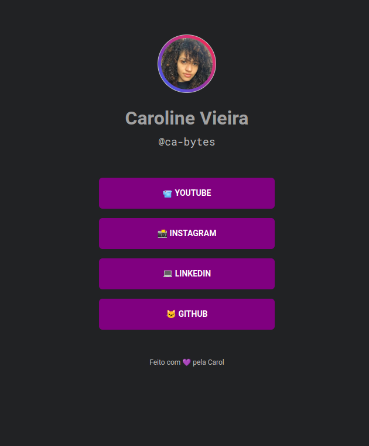

# maratona_explore2.0 Rockeseat

Have all your links in one place, here you go!

## 📋 Índice

- [Sobre](#-Sobre)
- [Tecnologias utilizadas](#-Tecnologias-utilizadas)

---

## 🖥 Preview

  

---

## 📖 Sobre

Este é um projeto desenvolvido durante a **[Maratona Explore 2.0](https://lp.rocketseat.com.br/inscricao/maratona-explorer?utm_source=youtube&utm_medium=video_description&utm_campaign=offer_maratona_explorer&utm_term=organic&utm_content=maratona-explorer-2.0)** durante os dias 3 a 6 de Julho de 2022.

In one place everything about you!

---

## 🚀 Tecnologias utilizadas

O projeto está desenvolvido utilizando as seguintes tecnologias:

- HTML
- CSS

---

Desenvolvido com 💜 por Caroline Vieira

